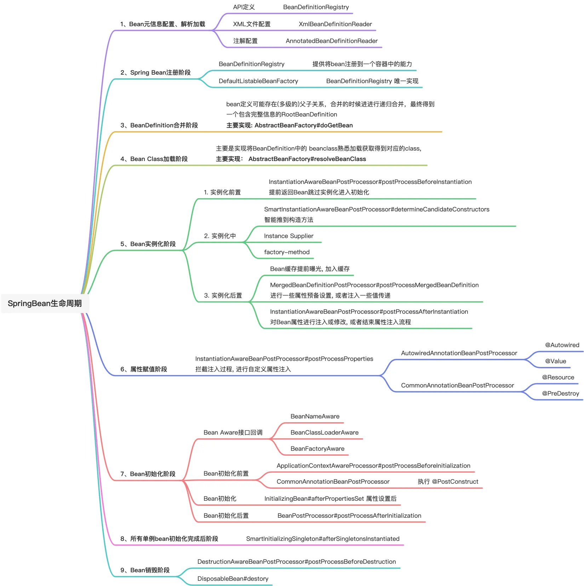

### 导图 

### 生命周期钩子
> SpringBean 生命周期第[1]步: 		执行 InstantiationAwareBeanPostProcessor#postProcessBeforeInstantiation 回调
> SpringBean 生命周期第[2]步: 		执行 SmartInstantiationAwareBeanPostProcessor#determineCandidateConstructors回调
> SpringBean 生命周期第[3]步: 		执行 MergedBeanDefinitionPostProcessor#postProcessMergedBeanDefinition 回调
> SpringBean 生命周期第[4]步: 		执行 InstantiationAwareBeanPostProcessor#postProcessAfterInstantiation 回调
> SpringBean 生命周期第[5]步: 		执行 InstantiationAwareBeanPostProcessor#postProcessProperties 回调
> SpringBean 生命周期第[6]步: 		执行 CommonAnnotationBeanPostProcessor#postProcessProperties 回调, 处理JSR-250自动注入
> SpringBean 生命周期第[7]步: 		执行 AutowiredAnnotationBeanPostProcessor#postProcessProperties 回调, 处理Spring自动注入
> SpringBean 生命周期第[8]步: 		执行  BeanNameAware#setBeanName 回调
> SpringBean 生命周期第[9]步: 		执行  BeanClassLoaderAware#setBeanClassLoader 回调
> SpringBean 生命周期第[10]步: 	执行  BeanFactoryAware#beanFactory 回调
> SpringBean 生命周期第[11]步: 	执行  ApplicationContextAware#setApplicationContext 回调
> SpringBean 生命周期第[12]步: 	执行 BeanPostProcessor#postProcessBeforeInitialization 回调
> SpringBean 生命周期第[13]步: 	执行 InitDestroyAnnotationBeanPostProcessor#postProcessBeforeInitialization  @PostConstruct  回调
> SpringBean 生命周期第[14]步: 	执行  InitializingBean#afterPropertiesSet 回调
> SpringBean 生命周期第[15]步: 	执行 自定义初始化方法 回调
> SpringBean 生命周期第[16]步: 	执行 BeanPostProcessor#postProcessAfterInitialization 回调
> SpringBean 生命周期第[17]步: 	执行 DestructionAwareBeanPostProcessor#postProcessBeforeDestruction 回调
> SpringBean 生命周期第[18]步: 	执行  InitDestroyAnnotationBeanPostProcessor.postProcessBeforeDestruction @PreDestroy 回调
> SpringBean 生命周期第[19]步: 	执行  DisposableBean#destroy 回调
> SpringBean 生命周期第[20]步: 	执行 自定义销毁方法 回调

