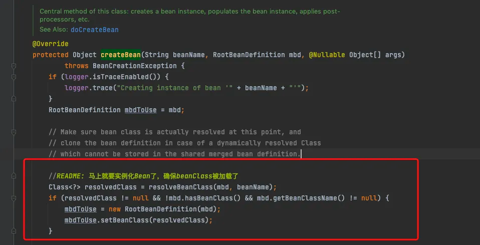

## 阶段一、Bean 元信息配置与解析
> **大前提** : Spring Bean 在实例化初始化之前, 其实都是以元对象 - `BeanDefinition` 存在；Spring容器启动的过程中，会将Bean解析成Spring内部的BeanDefinition结构。不管是是通过xml配置文件的<Bean>标签，还是通过注解配置的@Bean，还是@Compontent标注的类，还是扫描得到的类，它最终都会被解析成一个 `BeanDefinition `对象，最后Spring Bean工厂就会根据这份Bean的定义信息，对bean进行实例化、初始化等操作;
### SpringBean 元对象之 BeanDefinition
> BeanDefinition描述了关于Bean定义的各种信息,  例如:
> - bean对应的class
> - scope
> - lazy信息
> - dependOn信息
> - autowireCandidate(是否是候选对象)
> - primary(是否是主要的候选者)等信息
> - 是否单例/多例


BeanDefinition是个接口，有几个实现类，看一下类图：

**BeanDefinition 核心分类**

- RootBeanDefinition:   表示根Bean定义的信息, 通常没有父Bean情况下直接使用这个表示
- ChildBeanDefinition:  表示子Bean的定义信息
- GenericBeanDefinition: 通用的Bean定义信息
- ConfigurationClassBeanDefinition:  通过配置类下 `@Bean`  方法定义的Bean的信息
- AnnotationClassBeanDefinition:  通过注解的方式定义

**BeanDefinition 继承了两个接口**

- AttributeAccessor

相当于一种 k-v 的数据结构, 底层是一种LinkedHashMap实现, 用来存储BeanDefinition过程中一些附属信息

- BeanMetadataElement

该接口提供一个  `getResource` 方法, 用于查找BeanDefinition定义的来源

### Bean元信息配置与加载 3 种方式
#### 1. 基于XML

基于配置的容器启动过程如下,  本质上起来的是一个  `FileSystemXmlApplicationContext`对象
```java
public void testConfigBeanFromXml() {
    FileSystemXmlApplicationContext ctx = new FileSystemXmlApplicationContext("classpath:step1.xml");
    MetaConfigXmlBean bean = ctx.getBean(MetaConfigXmlBean.class);
    System.out.println(bean);
}
```
加载则是通过 `XmlBeanDefinitionReader`  进行相关文件的解析读取
```java
public void testParseFromXmlFile() {
    DefaultListableBeanFactory factory = new DefaultListableBeanFactory();
    XmlBeanDefinitionReader reader = new XmlBeanDefinitionReader(factory);
    int count = reader.loadBeanDefinitions(new ClassPathResource("step1.xml"));
    System.out.println("total load " + count + " bean definitions");

    for (String definitionName : factory.getBeanDefinitionNames()) {
        BeanDefinition definition = factory.getBeanDefinition(definitionName);
        System.out.println(definition);
    }
}
// 通过XML配置解析出来的BeanDefinition都是 `GenericBeanDefinition` 类型
// 输出
Generic bean: class [org.cnc.explain.liftcycle.beanparse_2.ParsedXmlBean]; scope=; abstract=false; lazyInit=false; autowireMode=0; dependencyCheck=0; autowireCandidate=true; primary=false; factoryBeanName=null; factoryMethodName=null; initMethodName=null; destroyMethodName=null; defined in class path resource [step2.xml]

Generic bean: class [org.cnc.explain.liftcycle.beanparse_2.ParsedXmlBean]; scope=; abstract=false; lazyInit=false; autowireMode=0; dependencyCheck=0; autowireCandidate=true; primary=false; factoryBeanName=null; factoryMethodName=null; initMethodName=null; destroyMethodName=null; defined in class path resource [step2.xml]

```

#### 2. 基于注解
基于注解的容器启动由 `AnnotationConfigApplciationContext`完成
```java
@Component/@Service/@Repositry 
public class TestBean{
}
// 方式二、通过@Configuration 标准的配置加载
@Configuration
public class AppConfiguration{
    @Bean
    public TestBean  testBean(){return new TestBean();}
}
//方式一、bean类上加对应的注解 这种需要采用注解 @ComponentScan扫描
@Test 
public void testConfigurationFromAnnotation(){ 
    AnnotationConfigApplicationContext ctx = new AnnotationConfigApplciationContext(AppConfiguraion.class);
    TestBean tb = ctx.getBean(TestBean.class);
}

```
解析交由给 `AnnotatedBeanDefinitionReader`完成
```java

public void testParseFromAnnotationConfiguration() {
    DefaultListableBeanFactory factory = new DefaultListableBeanFactory();
    AnnotatedBeanDefinitionReader reader = new AnnotatedBeanDefinitionReader(factory);
    // 注册到 bean-factory
    reader.register(MetaConfigBean.class);
       
    // 循环的获取BeanDefinition
    for(String beanDefinitionName : reader.getRegistry().getBeanDefinitionNames()){
        BeanDefinition definition = reader.getRegistry().getBeanDefinition(beanDefinitionName);
        System.out.println(definition);
        System.out.println(definition.getClass().getName());
    }
}
```
此外, 通过注解形式手动进行bean注册解析, 能够解析出 Bean 类上添加的一些关于BeanDefinition的注解,  `@ComponentScan` 就是基于这个做的扫描与注册, 底层的调用就是  `private <T> void AnnotatedBeanDefinitionReader#doRegisterBean` 方法, 创建一个 `AnnotationGenericBeanDefinition`  对象,  然后注册到内部的  `**BeanFactory**`** **工厂中** **中


看一下输出情况,  符合预期
```java
// bean 
@Component
@Primary
@Scope("prototype")
@Lazy
public class ParsedAnnotationBean{}

输出 >>> 
// BeanDefinition内容, 可以看到  scope、lazyInit、primary 等信息是配置的那样
Generic bean: class [org.cnc.spring.explain.configbean.MetaConfigBean]; scope=prototype; abstract=false; lazyInit=true; autowireMode=0; dependencyCheck=0; autowireCandidate=true; primary=true; factoryBeanName=null; factoryMethodName=null; initMethodName=null; destroyMethodName=null
// BeanDefinition
org.springframework.beans.factory.annotation.AnnotatedGenericBeanDefinition
```

**需要特别关注 **
> 基于 手动注解注入无法完成依赖注入, 也就是说通过 @Resoure或者@Autowired 标记的属性无法正常注入,   具体原因是因为依赖注入是需要依靠 `AutowiredAnnotationBeanPostProcessor`  和 `CommonAnnotationBeanPostProcessor`两个 **BeanPostProcessor** 完成处理的

```java
public class ParsedAnnotationDependenceBean{}

public class ParsedAnnotationBean {
	@Autowired
	ParsedAnnotationDependenceBean parsedAnnotationDependenceBeanAutowired;
	@Resource
	ParsedAnnotationDependenceBean parsedAnnotationDependenceBeanResource;
}

public void testParseFromAnnotationConfiguration() {
    DefaultListableBeanFactory factory = new DefaultListableBeanFactory();
    AnnotatedBeanDefinitionReader reader = new AnnotatedBeanDefinitionReader(factory);

    //注册注解处理器
    factory.addBeanPostProcessor(factory.getBean(CommonAnnotationBeanPostProcessor.class));
    factory.addBeanPostProcessor(factory.getBean(AutowiredAnnotationBeanPostProcessor.class));

    // 注册到 bean-factory
    reader.register(ParsedAnnotationDependenceBean.class);		//  被依赖bean
    reader.register(ParsedAnnotationBean.class); 				//  主bean
    
    ParsedAnnotationBean bean = factory.getBean(ParsedAnnotationBean.class);
}
```

#### 3. 基于API
基于API的方式则是通过手动创建一个 `BeanDefinition` 对象,注册到一个`BeanDefinitionRegistry` 中
```java
@Test
public void testConfigBeanFromBuilderApi() {
    // assign the bean name
    BeanDefinitionBuilder builder = BeanDefinitionBuilder.rootBeanDefinition(MetaConfigBean.class.getName());
    builder.addPropertyValue("name", "config from the builder API");
    BeanDefinition bd = builder.getBeanDefinition();
    // 创建spring 容器
    DefaultListableBeanFactory factory = new DefaultListableBeanFactory();
    // 调用registryBeanDefinition向容器中注册bean
    final String beanName = "metaConfigApiBean";
    factory.registerBeanDefinition(beanName, bd);

    // 获取bean
    MetaConfigBean bean = factory.getBean(beanName, MetaConfigBean.class);
    System.out.println(bean);
}
```

## 阶段二、**Spring Bean注册阶段**
> **首先明确一点, SpringBean注册其实可以认为就是 **`**BeanDefinition**`**的注册; **
>

这里就会涉及到一个关键的接口: `BeanDefinitionRegistry`**,** Spring Bean注册将解析好的Bean注册到Bean注册器/Bean工厂内, 在Spring整体框架内一些核心的BeanFactory实现了BeanDefinitionRegistry接口, 代表支持将BeanDefinition注册到对应的BeanFactory容器中, 看一下类图

BeanDefinition 接口有三个直接的实现类

- **GenericApplicationContext**:  这个是主要核心 `SpringApplicationContext`  父类, 可以看到很多重要的ApplicationContext都实现了这个类,  但是这个类不对 BeanDefinitionRegistry做具体实现，BeanDefinition注册相关的能力都委托给 DefaultListableBeanFactory


- **DefaultListableBeanFactory** :  BeanDefinitionRegistry 的`唯一使用到`实现, BeanDefinitionRegistry的主要能力都由这个类实现
- **SimpleBeanDefinitionRegistry**:  只在测试使用
  :::success
  **结论:  DefaultListableBeanFactory 是 BeanDefinitionRegistry 的唯一实现**
  :::


**DefaultListableBeanFactory **实现了 BeanFactory 也印证了注册BeanDefinition相当于注册Bean的说法,  当然具体Bean的生成和存储还是会有更多细节； Spring官方对此也有佐证，比如基于 Annotation 配置的Bean最终会走到 `org.springframework.context.annotation.AnnotatedBeanDefinitionReader#doRegisterBean` 方法,   实际上方法内注册是 `**BeanDefinition**`


测试下注册一个BeanDefinition 到 Registry, Factory有了BeanDefinition 就可以通过 getBean 去惰性的加载并获取一个Bean对象了
```java
@Test
public void testBeanDefinitionRegistry() {
    DefaultListableBeanFactory beanFactory = new DefaultListableBeanFactory();
    // 定义一个 bean definition
    GenericBeanDefinition gbd = new GenericBeanDefinition();
    gbd.setBeanClass(BeanDefinitionRegistryBean.class);
    // 注册
    beanFactory.registerBeanDefinition("bean", gbd);
    System.out.println(beanFactory.getBeanDefinition("bean"));
    System.out.println(beanFactory.containsBeanDefinition("bean"));
    System.out.println(Arrays.asList(beanFactory.getBeanDefinitionNames()));
    
    /**
    *  核心重点在 getBean的内部调用方法: {@link org.springframework.beans.factory.support.AbstractBeanFactory#doGetBean}
    */
    BeanDefinitionRegistryBean bean = beanFactory.getBean(BeanDefinitionRegistryBean.class);
}
```

这个阶段在Spring的代码流程中，分别对应

- XML 配置： `org.springframework.context.support.AbstractApplicationContext#obtainFreshBeanFactory`
- Annotation配置 :  `org.springframework.context.annotation.AnnotatedBeanDefinitionReader#doRegisterBean`

有兴趣可以代码追踪, 最终会在  `org.springframework.context.support.AbstractApplicationContext#refresh` 这个方法集合


## 阶段三、**BeanDefinition合并阶段**
> 一些场景下, 可能存在一些父子Bean的场景, Bean的一些set配置存在父级时, 就需要对Bean进行一个父子合并，才能得到一个完整的子Bean对象, 这个阶段是将父bean的BeanDefinition与子 bean的BeanDefinition进行合并，最终得到一个包含完整信息的 RootBeanDefinition;

具体进行 BeanDefinition 合并的地方在 `org.springframework.beans.factory.support.AbstractBeanFactory#doGetBean`

下一级完成这个步骤的方法是: `org.springframework.beans.factory.support.AbstractBeanFactory#getMergedBeanDefinition`

追踪往下可以看到完成的地方是在 `org.springframework.beans.factory.support.AbstractBeanDefinition#overrideFrom`, 很明显可以看出，所谓的合并BeanDefinition其实就是 子BeanDefinition 覆盖 父BeanDefinition的属性, 如: `Scope`,`Primary`等; 最终返回的父BeanDefinition就是完整的RootBeanDefinition;


> ⚠️  **注意 **:  很多时候, `AbstractBeanFactory#doGetBean`方法会作为创建bean的一个入口 , SpringBean  懒加载和非懒加载, 默认是非懒加载的
> - 非懒加载的 Bean 会在容器刷新阶段进行加载 , 具体地点是`org.springframework.context.support.AbstractApplicationContext#refresh`方法内对 `finishBeanFactoryInitialization(beanFactory)` 的调用, 深入查看可以看到这个方法内部最终还是会到  `doGetBean`方法


## 阶段四、**Bean Class加载阶段**
在`AbstractBeanDefinition` 中有一个属性 `private volatile Object beanClass`, 初始化时是一个字符串类型的BeanName, 在Bean的生命周期过程中, 通过 `AbstractBeanFactory#resolveBeanClass`方法将对应的BeanName转换为加载的Class对象, 然后设置到对应的BeanDefinition中去, 这个步骤发生在`AbstractAutowireCapableBeanFactory#createBean` 方法中

